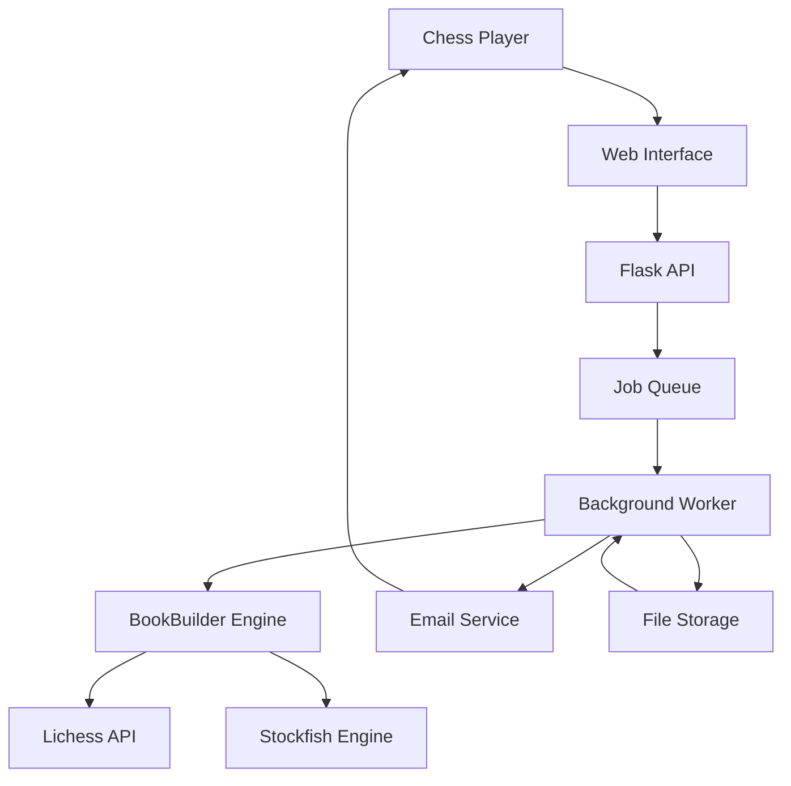

# BookBuilder Chess Repertoire Generator - System Design

## System Overview

**Current**: Synchronous Flask wrapper around Python chess engine  
**Target**: Async web application with email delivery for chess repertoire generation



## Architecture Design

### 1. Async Processing Architecture

#### Current State (Blocking)
```python
# app.py - Current Implementation
@app.route('/generate', methods=['POST'])
def generate_repertoire():
    # 5-30 minute blocking subprocess call
    process = subprocess.run(cmd, timeout=300)  # ❌ Blocks server
    return jsonify({"files": generated_files})
```

#### Target Design (Async)
```python
# Proposed Architecture
@app.route('/generate', methods=['POST'])
def generate_repertoire():
    job_id = str(uuid4())
    email = request.json.get('email')
    
    # Queue job for background processing
    generate_task.delay(job_id, config_data, email)
    
    return jsonify({
        "job_id": job_id,
        "status": "queued",
        "message": "Your repertoire is being generated. You'll receive an email when complete."
    })

@celery.task
def generate_task(job_id, config_data, email):
    work_dir = f"/tmp/bookbuilder_{job_id}"
    try:
        # Isolated execution environment
        run_bookbuilder_isolated(config_data, work_dir)
        send_results_email(email, work_dir)
    finally:
        cleanup_work_directory(work_dir)
```

#### Job Queue Technology Choice
**Recommendation: Celery + Redis**
- ✅ Railway Redis addon available
- ✅ Proven Python integration
- ✅ Built-in retry and error handling
- ✅ Progress tracking capabilities

**Alternative: Simple Background Jobs**
- ✅ Lighter weight, fewer dependencies
- ✅ File-based queue for small scale (1-5 users)
- ❌ Limited monitoring and retry capabilities

### 2. Resource Isolation Design

#### Work Directory Pattern
```python
# Per-job isolation
work_dir = f"/tmp/bookbuilder_{job_id}"
os.makedirs(work_dir, exist_ok=True)

config_path = os.path.join(work_dir, "config.yaml")
output_dir = os.path.join(work_dir, "output")

# Engine isolation
engine_path = f"/usr/local/bin/stockfish"  # Railway system path
```

#### Engine Management
```python
# Engine pool for concurrency
class EnginePool:
    def __init__(self, max_engines=3):
        self.engines = []
        self.max_engines = max_engines
    
    def get_engine(self):
        # Round-robin or least-busy selection
        pass
    
    def release_engine(self, engine):
        # Return to pool
        pass
```

### 3. Email Delivery System Design

#### Email Service Integration
**Recommendation: SendGrid (Railway Integration)**
```python
# Email configuration
SENDGRID_API_KEY = os.environ.get('SENDGRID_API_KEY')
FROM_EMAIL = 'noreply@bookbuilder.app'

def send_results_email(email, work_dir):
    files = glob.glob(f"{work_dir}/*.pgn")
    
    # Create email with attachments
    message = Mail(
        from_email=FROM_EMAIL,
        to_emails=email,
        subject='Your Chess Repertoire is Ready!',
        html_content=EMAIL_TEMPLATE
    )
    
    # Attach PGN files
    for file_path in files:
        with open(file_path, 'rb') as f:
            message.attachment = Attachment(
                FileContent(base64.b64encode(f.read()).decode()),
                FileName(os.path.basename(file_path)),
                FileType('application/x-chess-pgn')
            )
```

#### Email Template Design
```html
<!DOCTYPE html>
<html>
<head>
    <title>Your Chess Repertoire</title>
</head>
<body>
    <h1>♟️ Your Opening Repertoire is Ready!</h1>
    <p>Your chess opening repertoire has been successfully generated.</p>
    
    <h2>📁 Files Included:</h2>
    <ul>
        <!-- List of generated PGN files -->
    </ul>
    
    <h2>📚 How to Use:</h2>
    <p>Upload these PGN files to Chessable, Chess.com, or your preferred study platform.</p>
    
    <p><small>Generated by BookBuilder - We'll never use your email for anything else.</small></p>
</body>
</html>
```

### 4. Railway Deployment Architecture

#### Service Configuration
```yaml
# railway.toml
[build]
builder = "NIXPACKS"

[deploy]
startCommand = "gunicorn --workers 2 --timeout 300 app:app"

[environments]
production:
  REDIS_URL = "${{Railway.REDIS_URL}}"
  SENDGRID_API_KEY = "${{SENDGRID_API_KEY}}"
  STOCKFISH_PATH = "/usr/bin/stockfish"
```

#### Worker Process Design
```python
# worker.py - Background job processor
from celery import Celery

celery = Celery(__name__)
celery.conf.broker_url = os.environ.get('REDIS_URL')
celery.conf.result_backend = os.environ.get('REDIS_URL')

@celery.task(bind=True)
def generate_repertoire_task(self, job_id, config_data, email):
    try:
        # Update job status
        self.update_state(state='PROGRESS', meta={'progress': 0})
        
        # Create isolated work environment
        work_dir = create_work_directory(job_id)
        
        # Execute BookBuilder with progress tracking
        result = execute_bookbuilder_isolated(config_data, work_dir, self)
        
        # Send email with results
        send_results_email(email, work_dir, result)
        
        return {'status': 'complete', 'files': result['files']}
    
    except Exception as exc:
        # Chess-friendly error translation
        friendly_error = translate_chess_error(str(exc))
        send_error_email(email, friendly_error)
        raise
    
    finally:
        # Cleanup work directory
        cleanup_work_directory(work_dir)
```

### 5. Progress Tracking Design

#### Frontend Status Polling
```javascript
// Enhanced frontend for async processing
async function submitForm(formData) {
    const response = await fetch('/generate', {
        method: 'POST',
        headers: {'Content-Type': 'application/json'},
        body: JSON.stringify({
            ...formData,
            email: document.getElementById('email').value
        })
    });
    
    const result = await response.json();
    
    if (result.job_id) {
        showProgressTracking(result.job_id);
        pollJobStatus(result.job_id);
    }
}

function pollJobStatus(jobId) {
    const interval = setInterval(async () => {
        const response = await fetch(`/status/${jobId}`);
        const status = await response.json();
        
        updateProgressDisplay(status);
        
        if (status.state === 'SUCCESS' || status.state === 'FAILURE') {
            clearInterval(interval);
        }
    }, 5000);
}
```

#### Status Endpoint Design
```python
@app.route('/status/<job_id>')
def job_status(job_id):
    task = generate_repertoire_task.AsyncResult(job_id)
    
    if task.state == 'PENDING':
        response = {'state': 'PENDING', 'progress': 0}
    elif task.state == 'PROGRESS':
        response = {
            'state': 'PROGRESS',
            'progress': task.info.get('progress', 0),
            'current_step': task.info.get('current_step', 'Analyzing...')
        }
    elif task.state == 'SUCCESS':
        response = {'state': 'SUCCESS', 'result': task.result}
    else:
        response = {'state': 'FAILURE', 'error': str(task.info)}
    
    return jsonify(response)
```

## Implementation Specifications

### Phase 1: Core Async Foundation (Days 1-3)

#### 1.1 Job Queue Setup
```bash
# Dependencies to add
pip install celery redis sendgrid
```

```python
# New files needed:
- worker.py: Celery task definitions
- email_service.py: Email delivery logic
- job_manager.py: Job lifecycle management
```

#### 1.2 Frontend Modifications
```javascript
// Updates to existing HTML_TEMPLATE in app.py:
- Add email input field
- Replace sync form submission with async job submission
- Add progress tracking UI
- Remove file download links (email delivery only)
```

#### 1.3 Backend Route Changes
```python
# Modify existing routes in app.py:
- /generate: Convert to job queue submission
- /status/<job_id>: New endpoint for job progress
- Remove /download route (replaced by email)
```

### Phase 2: Email Integration (Day 4)

#### 2.1 SendGrid Setup
- Railway environment variable: `SENDGRID_API_KEY`
- Email template with PGN attachments
- Privacy policy for email usage

#### 2.2 Error Translation
```python
# Chess-friendly error mapping
ERROR_TRANSLATIONS = {
    "Invalid PGN": "The opening moves you entered aren't valid chess notation. Please check your PGN format.",
    "Engine not found": "Chess engine is temporarily unavailable. Please try again in a few minutes.",
    "API rate limit": "Too many players are generating repertoires. You're in the queue and will receive your results soon.",
    "Timeout": "Your repertoire is very complex and taking longer than expected. You'll receive an email when complete."
}
```

### Phase 3: Railway Deployment (Day 5)

#### 3.1 Infrastructure Setup
- Redis addon for job queue
- Stockfish installation via buildpack
- Environment variable configuration
- Process scaling for web + worker

#### 3.2 Production Configuration
```python
# Production settings
CELERY_BROKER_URL = os.environ.get('REDIS_URL')
STOCKFISH_PATH = '/usr/bin/stockfish'  # Railway system path
MAX_CONCURRENT_JOBS = 2  # Railway resource limits
```

## File Structure Changes

### New Files Required
```
├── worker.py              # Celery task definitions
├── email_service.py       # Email delivery and templates
├── job_manager.py         # Job lifecycle management
├── error_translator.py    # Chess-friendly error messages
└── requirements_async.txt # Additional dependencies
```

### Modified Files
```
├── app.py                 # Convert routes to async job submission
├── requirements.txt       # Add celery, redis, sendgrid
└── Procfile              # Add worker process for Railway
```

## Success Metrics

### Technical Metrics
- **Concurrent Users**: Support 2-3 simultaneous repertoire generations
- **Processing Time**: 30+ minute repertoires without timeouts
- **Email Delivery**: <2min delivery after completion
- **Resource Usage**: <500MB memory per job, auto-cleanup

### User Experience Metrics
- **Form Submission**: <5 seconds to job queue
- **Progress Feedback**: Status updates every 30 seconds
- **Error Recovery**: Clear next-steps for all failure modes
- **Email Reliability**: 99% delivery rate for completed repertoires

## Migration Strategy

### Preservation Approach
**✅ Keep Unchanged:**
- BookBuilder.py engine logic (100% preserved)
- Web form UI and configuration options
- Chess analysis algorithms and statistical methods
- Lichess API integration patterns

**🔄 Architectural Changes:**
- Flask routes: sync → async job submission
- Process execution: subprocess → isolated Celery tasks
- Result delivery: file download → email attachments
- Resource management: shared → per-job isolation

### Risk Mitigation
1. **Preserve Chess Logic**: BookBuilder.py remains unchanged, only execution context changes
2. **Gradual Migration**: Test async processing with simple repertoires first
3. **Fallback Option**: Keep current sync endpoint as `/generate_sync` during transition
4. **Email Validation**: Test email delivery extensively before production

This design preserves your sophisticated chess analysis while enabling production deployment with proper concurrency, email delivery, and Railway hosting.